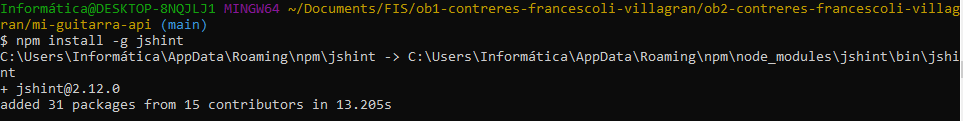
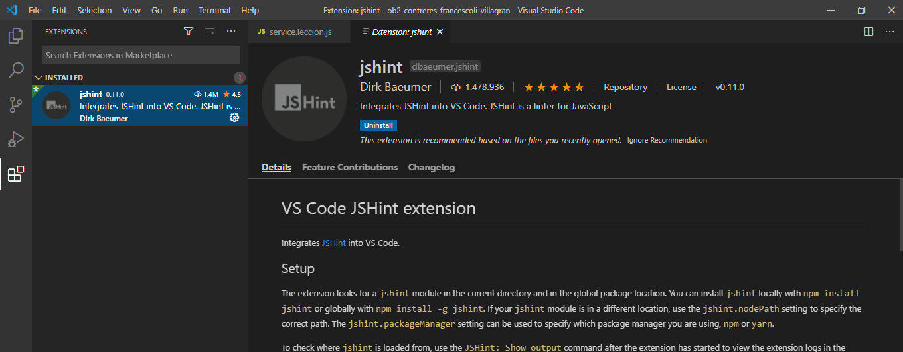
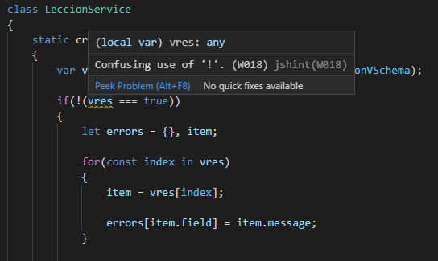
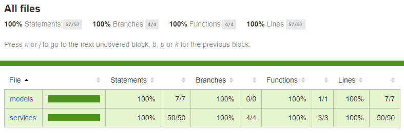

# Fundamentos de Ingeniería de Software - Obligatorio 2

N3A - Docente: Gabriela Sánchez

Estudiantes:
- Ignacio Contreres (228218)
- Lucia Francescoli (264704)
- Ignacio Villagrán (125684)

23/11/2020

https://github.com/ORT-FIS-202008/ob1-contreres-francescoli-villagran

## Comentarios generales
La aplicación se desarrolló utilizando las siguientes tecnologías/aplicaciones:
- Angular js para el frontend. Angular es un framework de desarrolo en javascript, por lo que de fondo utiliza javascript, css, html y typescript para funcionar.
- Node.js para el backend.
- Visual Studio Code
- Jest

La comunicación entre el frontend y el backend se realiza a través de un proxy implententado para redirigir los pedidos que llegan a localhost:4200/api hacia localhost:3000/api

Para facilitar la visualización y la realización de pruebas, se precargaron algunas lecciones que se reincian cada vez que se detiene la ejecución de node.js y se vuelve a inciar. 
Estas lecciones contienen vídeos de youtube que no son de nuestra propiedad, no tenemos autorización de sus autores para utilizarlos y los incluimos con motivos meramente educativos.

## Calidad de código

Utilizamos Google HTML/CSS Style Guide como estándar de código (https://google.github.io/styleguide/htmlcssguide.html).

Como analizadores de código estático se utilizaron JSnippet y ESLint en Visual Studio Code. Adicionalmente se instala jsHint y su extensión para Visual Studio Code. Se encuentra con este último una sugerencia sobre el código y se corrige.

## Prueba unitaria

### **Jest**

Se utilizó la herramienta Jest para los tests unitarios.

Se realizaron validaciones de título, descripción, URL de youtube, URL de tablatura y nivel de dificultad para una lección.

También, se validó la creación de una nueva lección, y de los mensajes de error.

Para correr las pruebas debe ejecutarse el comando "npm run test" en una consola. Es impresindible tener la consola que ejecuta el node.js abierta y corriendo al momento de ejecutar las pruebas.

### **Cobertura**

Se realizó una cobertura total, tanto en lineas, ramas como en funciones. Se puede ver el informe de cobertura generado por Jest en la siguiente imagen:

Para correr las pruebas con el análisis de cobertura debe ejecutarse el comando "npm run test:coverage"

## Interfaz de usuario

Se utilizó Angular para realizar la interfaz de usuario pues consideramos que es un Framework con una curva de aprendizaje razonable. 

Para crear un buen diseño de interfaz se tomaron en cuenta las heurísticas de Nielsen.

### **1-Visibilidad del estado del sistema**
Al llenar el formulario para agregar una nueva lección, cada vez que el usuario se encuentra en un campo ese le va indicando los requerimientos.
Además, el botón de "Agregar Lección" queda inhabilitado y se muestra con una capa gris. Cuando el formulario sí cumple con todo se habilita el botón y se muestra el botón verde. 

### **2-Coinicidencia entre el sistema y el mundo real**
Se utilizaron términos y lenguajes cotidianos para que todos los usuarios puedan entender lo que solicita el sistema y encontrar fácil la funcionalidad a usar.

### **3-Darle al usuario control y libertad**
Cuando se esta completando el formulario se puede borrar antes de agregar la lección y hay opción para cambiar de pantalla de navegación.

### **4-Consistencia y estándares**
Siempre se utliza el mismo lenguaje en todo el sistema, y es parte del lenguaje conocido tanto por niños como adultos.

### **5-Prevención de errores**
Para evitar errores al agregar una lección, se usan validaciones en los campos requeridos del formulario. El campo de dificultad viene pre cargado con tan solo 3 opciones: principiante, intermedio y avanzado. 
Esto es para evitar que se usen sinónimos que posteriormente dificultan el filtrado de las lecciones por nivel de dificultad.

### **6-Reconocer en lugar de recordar**
Los íconos del menú lateral además de ser pictográficos tienen una leyenda que aclara la función de la pantalla a clickear.

### **7-Flexibilidad y eficiencia de uso**
Se accede muy fácilmente a ver o agregar las lecciones. No hay pasos intermedios que disminuyen la eficiencia.

### **8-Estética y diseño minimalista**
Se utilizó un diseño en color negro, con íconos pictográficos en blanco. Debido a que es un diseño atractivo y fácil de utilizar para todos los tipos de usuario del sistema (niños y adultos).
Además, se muestra lo mínimo indispensable para que el usuario pueda realizar todas las tareas que necesite.

### **9-Ayuda al usuario a reconocer, diagnosticar y recuperarse de los errores**
Los errores que se pueden dar en las funciones implementadas son con respecto al rellenado de los campos del formulario de agregar lección. 
Estos tienen validaciones que indican cuando hay un error pero tambén permiten cambiar lo que estaba allí escrito.

### **10-Ayuda y documentación**
No se tuvo en cuenta para la realización de este obligatorio.

## Construcción

En el sistema creado se implementaron dos funciones:
- Ver Lecciones
- Agregar Lección

Para cada una de ellas se creó una pantalla específica, y se puede navegar de una a otra usando un menú lateral.

### **BUILD**
Nota: es necesario mantener 2 consolas abiertas para poder probar la aplicación.

Prerequisito: Es necesario tener instalado Git y Node.js para poder seguir estos pasos.

Pasos para ejecutar la aplicación
- Clonar el repositorio localmente utilizando el comando "git clone https://github.com/ORT-FIS-202008/ob1-contreres-francescoli-villagran"
- En una terminal acceder a la carpeta ob2-contreres-francescoli-villagran/mi-guitarra-api
- Ejecutar el comando "npm install"
- Ejecutar el comando "npm start"
- Mantener esta consola abierta y abrir otra consola de comandos
- En la segunda consola acceder a la carpeta ob2-contreres-francescoli-villagran
- Ejecutar el comando "npm install"
- Ejecutar el comando "npm start"
- Acceder en un navegador (Chrome, Firefox o Edge) al sitio "http://localhost:4200"

## Testing funcional

### **Casos de Prueba**

Se realizaron casos de prueba de las funcionalidades del sistema para verificar que fueran satisfactorias.
Estos se detallan en el siguiente archivo.

[Casos de Prueba](testing_docs/CasosDePrueba.pdf)

Los casos de prueba no satisfactorios coincidieron con aquellos issues que consideramos de baja prioridad.
Por lo tanto, concluimos que el sistema creado es suficientemente satisfactorio.

### **Testing Exploratorio**

Se realizaron sesiones de testing exploratorio. Cada una de ellas se detalla individualmente.

[Sesión Testing Exploratorio 1](testing_docs/TestingExploratorio1.pdf)

[Sesión Testing Exploratorio 2](testing_docs/TestingExploratorio2.pdf)

## Reporte de defectos

En cuanto se detectaba algún tipo de defecto, se reportaba en la herramienta de registro de Issues de GitHub (https://github.com/ORT-FIS-202008/ob1-contreres-francescoli-villagran/issues) con la etiqueta correspondiente al tipo de defecto (bug o enhancement).

## Análisis crítico del estado de la calidad del software

Para poder analizar el estado de la calidad del software tomamos en cuenta las funciones que se debían construir y los distinitos tipos de testing realizados. 
Se implementaron sesiones de testing exploratorio, se determinaron casos de prueba, y se logró un nivel de cobertura del 100% con las pruebas unitarias.
Se resolvieron todos los Issues reportados, con la excepción de la duplicación de agregar lección. Esto fue considerado de baja prioridad ya que no afecta la visualización de las clases por parte de los usuarios alumnos, y tampoco le genera errores a los usuarios del tipo profesor que buscan agregar una lección.
Tomando en cuenta los resultados de todas estas acciones, se puede concluir que logramos un estado de la calidad del software satisfactorio de acuerdo a los objetivos planteados. Se cumple con las dos funciones requeridas correctamente, y sin aparentes problemas de ejecucción.

## Trabajo individual

| Sección   | Descripción  | Desarrollador  |
|-|-|-|
| Calidad de código  | Aplicar buenas prácticas de codificación  | Lucía Francescoli, Ignacio Contreres e Ignacio Villagrán  |
| Calidad de código  | Documentar el uso de analizadores estáticos de código  | Ignacio Contreres e Ignacio Villagrán  |
| Calidad de código  | Verificar y ajustar el código al estandar elegido  | Ignacio Villagrán  |
| Prueba unitaria  | Codificar métodos de pruebas unitarias para todas las funciones  | Lucía Francescoli, Ignacio Contreres e Ignacio Villagrán  |
| Interfaz de usuario y construcción  | Frontend  | Ignacio Contreres e Ignacio Villagrán  |
| Interfaz de usuario y construcción  | Backend  | Ignacio Villagrán  |
| Interfaz de usuario y construcción  | Construir y entregar un ejecutable funcionando  |  Lucía Francescoli, Ignacio Contreres e Ignacio Villagrán  |
| Testing funcional  | Generar casos de prueba  | Lucía Francescoli e Ignacio Contreres  |
| Testing funcional  | Sesiones de pruebas exploratorias  | Lucía Francescoli e Ignacio Villagrán  |
| Reporte de defectos  | Reportar los defectos encontrados  | Lucía Francescoli, Ignacio Contreres e Ignacio Villagrán  |
| Reporte de defectos  | Análisis crítico del estado de la calidad del software  | Lucía Francescoli  |

